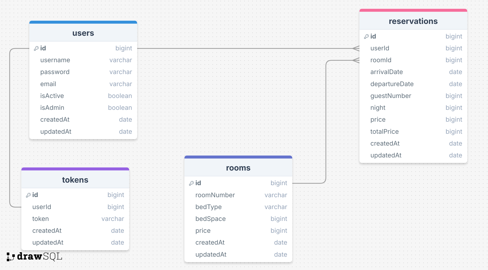

# HOTEL API

### ERD:


### HOTEL API PROJECT

In this project, I tried to ensure that customers book a room by specifying the date range they want to stay. They can choose the rooms they want to stay in according to the bed type.
    * The API also keeps log records. 
    * File uploads are made with multer.
    * And an e-mail is sent to the new user with nodemailer.

### Folder/File Structure:

```
    .env
    .gitignore
    index.js
    package.json
    readme.md
    swaggerAutogen.js
    src/
        config/
            dbConnection.js
            swagger.json
        controllers/
            auth.js
            reservation.js
            room.js
            token.js
            user.js
        errors/
            customError.js
        helpers/
            passwordEncrypt.js
            sendMail.js
        middlewares/
            authentication.js
            errorHandler.js
            queryHandler.js
            logger.js
            permissions.js
            upload.js
        models/
            reservation.js
            room.js
            token.js
            user.js
        routes/
            auth.js
            index.js
            reservation.js
            room.js
            token.js
            user.js
```